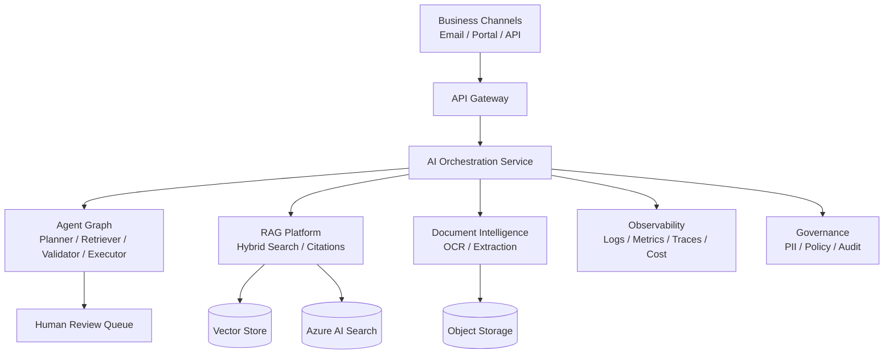

# Enterprise AI Architecture Showcase

Sanitized architecture portfolio for enterprise AI, Agentic AI, RAG, document
intelligence, workflow automation, and production AI governance patterns.

This repository intentionally avoids client code, proprietary data, private
architecture names, credentials, and production metrics that cannot be shared.
It focuses on reusable architecture thinking: decisions, diagrams, trade-offs,
security controls, scalability patterns, and implementation-ready templates.

## What This Demonstrates

- AI solution architecture and platform decomposition
- Agentic AI workflow design with human approval and tool controls
- Enterprise RAG reference architecture
- OCR + LLM document intelligence pipeline design
- Event-driven GenAI automation using Azure-style services
- Security, governance, observability, and cost-control patterns

## Repository Structure

```text
adrs/                       Architecture decision records
hld/                        High-level architecture documents
lld/                        Low-level implementation designs
diagrams/                   Mermaid architecture and sequence diagrams
system-design/              Detailed platform design documents
patterns/                   Reusable enterprise AI patterns
security/                   AI security and governance controls
observability/              OpenTelemetry, monitoring, and failure-analysis patterns
operations/                 Monitoring, cost, release, and runbook notes
```

## Reference Architecture Map



## Architecture Themes

| Theme | Included Artifacts |
| --- | --- |
| Agentic AI | Multi-agent workflow HLD, approval sequence, tool policy ADR |
| Enterprise RAG | HLD, LLD, evaluation metrics, vector-store abstraction |
| Document AI | OCR and LLM extraction design, schema validation, review gates |
| Event-Driven AI | Email-to-case sequence, queueing, retries, dead-letter handling |
| Governance | PII controls, audit trail, role-aware access, AI security notes |
| Operations | Monitoring, release checklist, cost optimization, scalability notes |
| Observability | OpenTelemetry, Application Insights, structured logging, failure analysis |

## How To Use This Repo

Use these artifacts in interviews and architecture reviews to explain how an AI
system moves from a demo to an enterprise-ready platform:

1. Start with the HLD to explain business flow and boundaries.
2. Use ADRs to show trade-offs and decision quality.
3. Use LLDs to discuss data models, APIs, retries, and observability.
4. Use security and operations notes to show production readiness.

## Non-Goals

- No client-specific implementation details
- No private datasets
- No hidden production claims
- No fake benchmarks or inflated metrics
