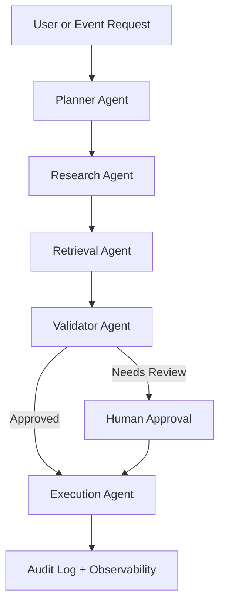

# HLD: Agentic AI Workflow Platform

## Goal

Coordinate multi-step enterprise workflows using specialized agents, controlled
tools, explicit state, and human approval gates.

## Agent Graph

## Agent Responsibilities

- Planner Agent: decomposes the task and selects the workflow path.
- Research Agent: gathers context from approved knowledge sources.
- Retrieval Agent: performs grounded search and citation gathering.
- Validator Agent: checks policy, confidence, and business rules.
- Execution Agent: performs allowed writes or creates draft payloads.

## Safety Controls

- Tool allowlists per agent
- Human approval before sensitive writes
- Retry budgets and timeout limits
- Structured audit events
- Cost and token tracking
