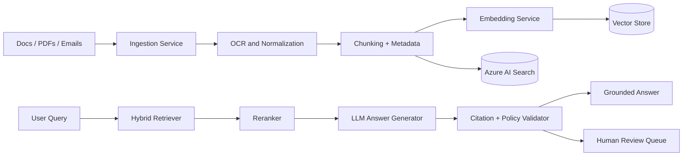

# HLD: Enterprise RAG Platform

## Goal

Provide grounded, citation-backed answers over enterprise documents while
supporting governance, observability, and measurable retrieval quality.

## Logical Architecture

## Key Design Points

- Separate ingestion from query-time retrieval.
- Preserve source metadata for citations and access control.
- Use hybrid search for enterprise text where exact terms matter.
- Add evaluation datasets before tuning retrieval parameters.
- Route low-confidence or unsupported answers to review.

## Production Concerns

- Tenant and role-aware filtering
- PII/PHI redaction before indexing where required
- Embedding cost monitoring
- Index lifecycle management
- Retrieval drift monitoring
