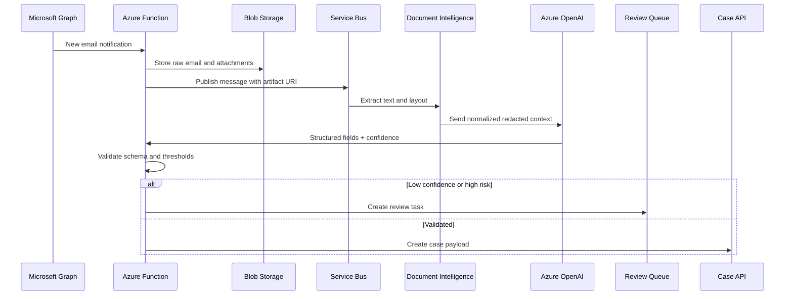

# LLD: Email-to-Case GenAI Automation Sequence

## Implementation Notes

- Use idempotency keys from message IDs.
- Keep source artifact links for audit.
- Redact sensitive data before logging.
- Send failed events to DLQ with retry metadata.
