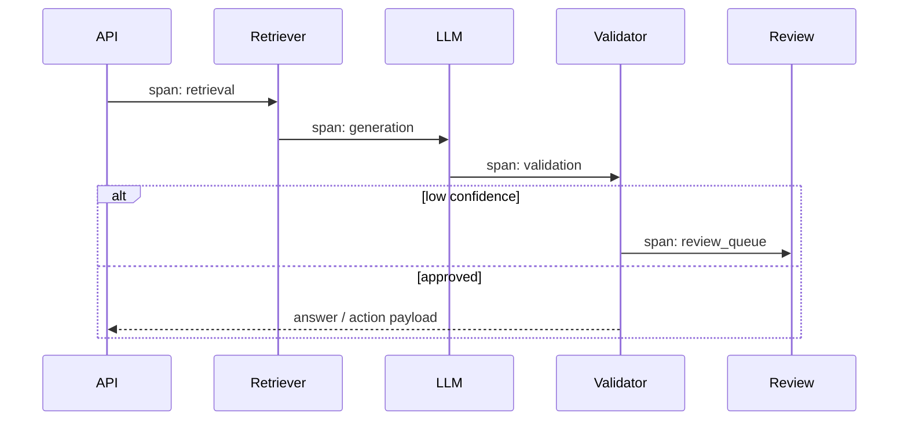

# Observability Architecture for Enterprise AI

## Goals

- Trace a request across API, retrieval, LLM, validation, review, and downstream writes.
- Detect failure patterns before users lose trust.
- Track quality, latency, cost, and safety signals.

## Reference Stack

| Concern | Tooling Pattern |
| --- | --- |
| Distributed tracing | OpenTelemetry |
| Azure monitoring | Application Insights |
| Metrics | Prometheus-style counters and histograms |
| Dashboards | Grafana or cloud-native dashboards |
| Logs | Structured JSON logs with request IDs |
| Failure analysis | DLQ inspection, retry history, validation errors |

## Trace Model

## Key Metrics

- Request latency by workflow and tenant
- Retrieval recall proxy and citation support rate
- LLM validation failure rate
- Human review rate
- Retry count and DLQ depth
- Cost units or token usage per workflow
- Prompt/model version regression signals
