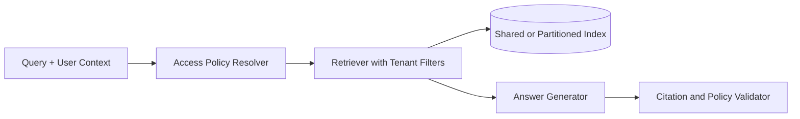

# Pattern: Multi-Tenant Enterprise RAG

## Problem

Multiple teams or customers need RAG over shared infrastructure without leaking
documents, citations, metadata, or generated answers across boundaries.

## Pattern

- Attach tenant, workspace, and role metadata to every chunk.
- Enforce filters at retrieval time, not only in the application UI.
- Keep evaluation datasets segmented by tenant or domain.
- Emit audit logs for retrieved source IDs.

## Mermaid View

