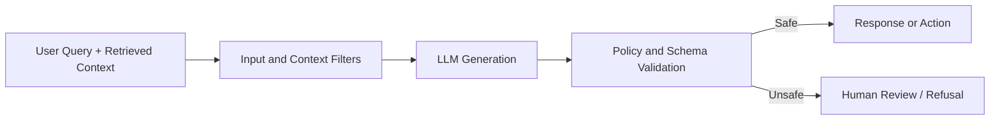

# Prompt Injection and AI Security Controls

## Threats

- Prompt injection in retrieved documents
- Tool-use manipulation
- Data exfiltration through model responses
- Cross-tenant information leakage
- Unsafe automation writes

## Controls

- Treat retrieved text as untrusted input.
- Keep system/tool instructions outside retrievable content.
- Use allowlisted tools per workflow node.
- Validate structured outputs before writes.
- Enforce tenant and role filters during retrieval.
- Require human approval for sensitive actions.

## Guardrail Flow

