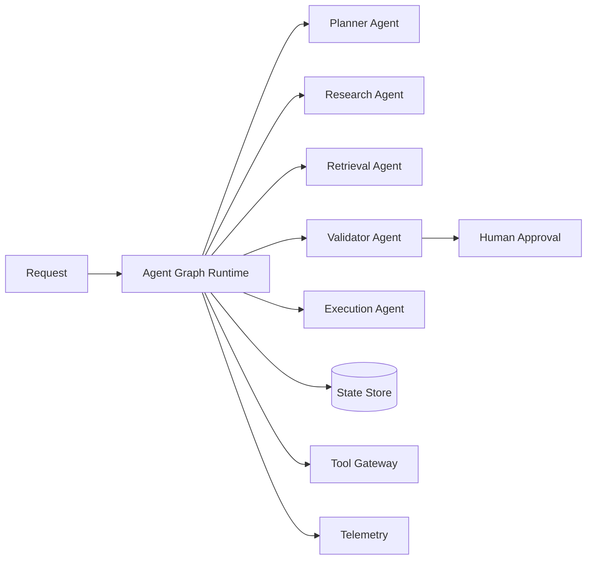

# System Design: Agentic AI Platform

## Business Problem

Coordinate multi-step AI workflows where agents can plan, retrieve, validate,
and execute within safe tool boundaries.

## Component Diagram

## Failure Scenarios

- Tool failure: retry with budget, then route to review.
- Low retrieval confidence: ask clarifying question or review.
- Unsafe action: block execution and log policy reason.
- State checkpoint failure: pause workflow and alert operations.

## Cost Strategy

- Use smaller models for planning/classification.
- Cache retrieval context.
- Track token/cost per workflow node.
