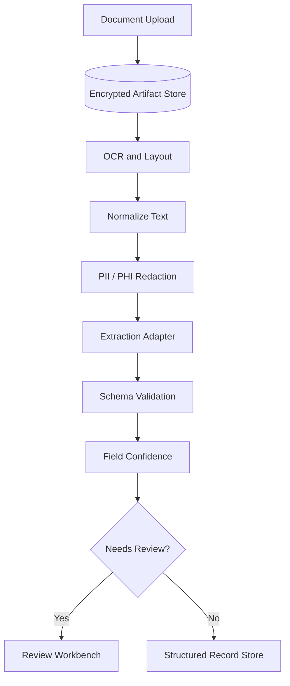

# System Design: Document Intelligence Platform

## Business Problem

Convert unstructured documents into validated structured records with privacy,
traceability, and human review for low-confidence fields.

## Data Flow

## Capacity Planning

- OCR throughput by page count and document type.
- Extraction latency by model class.
- Review capacity for low-confidence records.
- Storage lifecycle for raw and normalized artifacts.

## Security

- Encrypt artifacts at rest.
- Redact sensitive fields before logs and prompts.
- Audit field-level source references.
