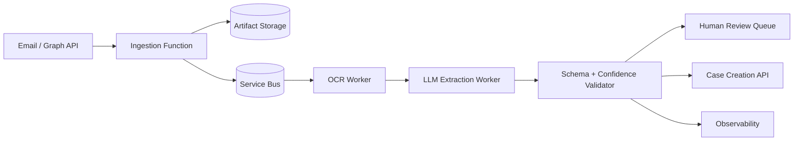

# System Design: Email-to-Case Platform

## Business Problem

Automate conversion of inbound emails and attachments into validated case
records while preserving auditability and routing uncertain cases to humans.

## Expected Scale

Design target: burst-friendly ingestion with queue-backed processing. Capacity
planning should be based on daily email volume, attachment size, OCR latency,
LLM throughput, review backlog, and downstream case API limits.

## Component Diagram

## Failure Scenarios

- Email API throttling: backoff and replay.
- OCR failure: route artifact to review with failure reason.
- LLM timeout: retry within budget, then DLQ.
- Case API conflict: use idempotency key and safe retry.

## Disaster Recovery

- Raw artifacts remain in object storage.
- Queue replay supports reprocessing.
- Case creation uses idempotency keys to avoid duplicates.
