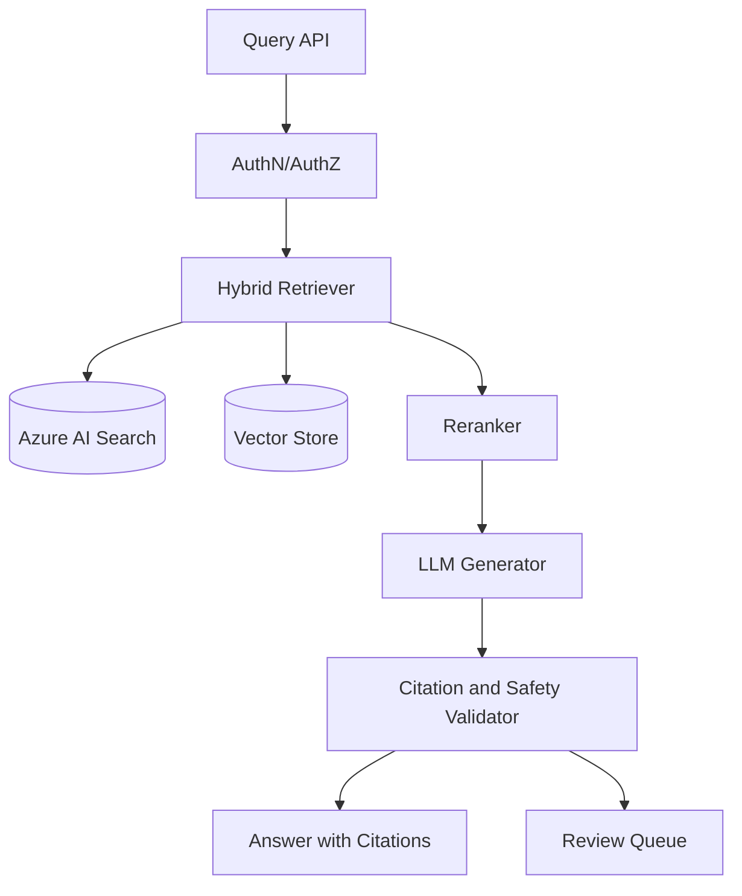

# System Design: Enterprise RAG Platform

## Business Problem

Provide citation-backed answers over enterprise knowledge without leaking data
or generating unsupported responses.

## Deployment Diagram

## Capacity Planning

- Document count and chunk count.
- Embedding refresh rate.
- Query QPS and peak concurrency.
- Index replica/partition strategy.
- Reranking and generation latency budgets.

## Operational Strategy

- Regression benchmark before retrieval config changes.
- Monitor citation support and no-answer rate.
- Track index freshness and failed ingestion jobs.
