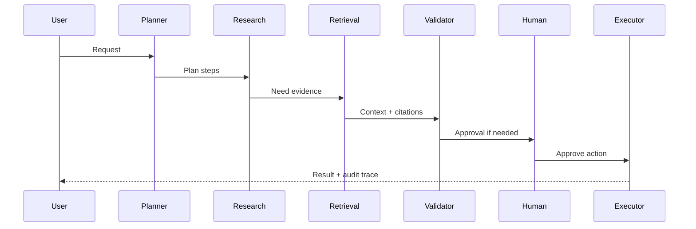

# System Design: Multi-Agent Workflow Platform

## Agent Roles

- Planner Agent: decomposes the task.
- Research Agent: gathers approved context.
- Retrieval Agent: retrieves grounded evidence.
- Validator Agent: checks policy, confidence, and schema.
- Execution Agent: performs approved actions.

## Sequence

## Operational Strategy

- Persist state between nodes.
- Emit audit event per node.
- Apply tool allowlists per agent.
- Set retry and cost budgets per workflow.
